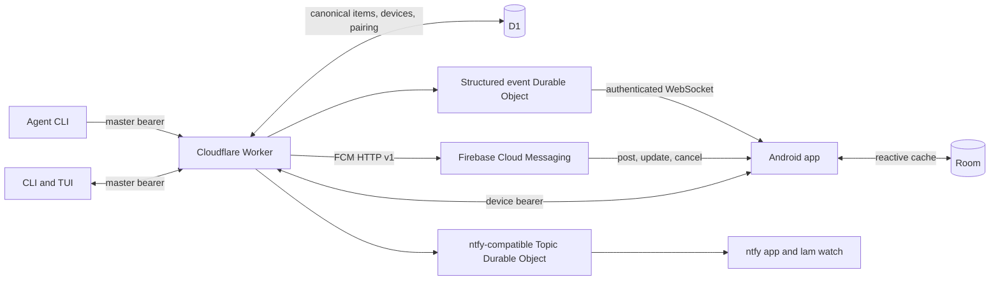

# lam Android app design

Date: 2026-09-03

Status: approved design, awaiting written-spec review

## Context

`lam` is a personal decision queue between AI agents and Carlos. Agents create blockers through the Rust CLI. A Cloudflare Worker stores them in D1. Carlos answers through the terminal UI, CLI, an ntfy Android client, or an HMAC-authenticated phone page. Agents block on the answer through `lam wait`.

The terminal UI now gives a much better view of outstanding work than ntfy. It separates open requests from history, renders markdown, supports checklists, preserves agent identity, and removes resolved work from the active queue. The ntfy app presents a stream of messages, so new, updated, and closed events accumulate together and obscure what still needs attention.

The project will add a private Android app that makes the D1-backed queue the mobile experience. It will retain the existing Worker, CLI, TUI, phone page, and ntfy-compatible topic during rollout.

## Goals

- Replace ntfy as Carlos's primary Android interface for `lam`.
- Receive Android notifications over Wi-Fi or mobile data outside the home network.
- Present a clean queue containing only open requests.
- Keep the Android queue, TUI, and CLI synchronized in both directions.
- Render request markdown in a focused mobile detail screen.
- Support choices, free-text replies, simple completion, dismissal, links, and interactive checklists.
- Require agents to state their recommended approach for decision requests and make it prominent in the TUI and Android app.
- Cache the last synchronized queue for offline reading without accepting offline mutations.
- Pair multiple personal Android devices without putting the master token in the APK or QR code.
- Install and upgrade a signed private build through ADB.

## Non-goals for version 1

- Creating, editing, or retracting requests from Android
- Conversation threads, comments, or non-final replies
- Attachments or remote markdown images
- Multiple users, accounts, or `lam` servers
- Light theme
- Play Store or Firebase App Distribution
- Widgets or Wear OS
- Biometric app lock
- Reopening closed requests
- Removing the ntfy-compatible routes or breaking `lam watch`

Free text remains a final answer. `lam` stays a decision queue rather than becoming a messaging system.

## Users and supported devices

The system has one human user, Carlos, and supports multiple devices owned by him. The first target is a Samsung SM-S928B, Galaxy S24 Ultra, running Android 16 at API 36 with Google Play Services installed.

The Android project will:

- Use application ID `dev.carraes.lam`.
- Compile and target API 36.
- Set minimum API 29.
- Use the lowercase app label `lam`.

## Architecture

The Worker and D1 remain the center of the system. The Android app is another client, not a second backend.



The main rule is simple: D1 owns item state. WebSocket and FCM messages only report that state may have changed. Clients fetch canonical state before enabling a response.

The phone talks directly to the public Worker. No mobile behavior depends on the home network.

### Mutation sequence

1. A client sends an authenticated mutation to the Worker.
2. The Worker validates authority and current item state.
3. D1 commits the mutation and increments the item version.
4. The Worker schedules structured-event, FCM, and existing ntfy publication through `waitUntil`.
5. Foreground clients receive an invalidation and fetch canonical state.
6. Background Android devices post, update, or cancel the corresponding system notification.

Failure to publish a notification never rolls back an item mutation. A later reconciliation repairs missed delivery.

## Item model

Items retain their current fields and gain two nullable fields:

```ts
recommendation: string | null
recommended_choice: string | null
```

Rules:

- Every new non-checklist push is a decision request for CLI validation, including a plain request whose only fixed action is `Done`.
- New decision requests require `recommendation` in the CLI.
- Requests with choices also require `recommended_choice`.
- `recommended_choice` must exactly match one of the item's choices.
- Checklist requests need neither recommendation field.
- The API accepts missing fields during the compatibility period.
- Existing D1 rows decode both fields as `null`.
- Android and the TUI visibly report when a non-checklist item lacks a recommendation.

Duplicate detection compares all meaningful request content:

- Agent name
- Title and body
- Priority
- Choices and checks
- Link and TTL
- Recommendation and recommended choice

The Worker hashes a canonical JSON representation of these fields into an internal `dedupe_key`. A new nullable D1 column and index make the complete comparison cheap and keep TTL comparison precise. New pushes always receive a key. During migration, an open legacy row without a key may still use the old name, title, and body fallback. An identical retry returns the existing open item. Changing the advice creates a distinct request.

### Content limits

The API and CLI enforce limits by UTF-8 character count unless the limit is stated in bytes:

| Field | Limit |
|---|---:|
| Title | 200 characters |
| Body | 64 KiB |
| Recommendation | 2,000 characters |
| Reply | 8 KiB |
| Choice label | 200 characters |
| Check label | 200 characters |
| Choices | 3 |
| Checks | 50 |

### Lifecycle

The item lifecycle remains one-way:

```text
open -> resolved
open -> dismissed
open -> retracted
open -> expired
```

Every mutation increments `version`. Expiration remains derived when an open row passes `expires_at`. The server rejects writes to closed or expired items. The final completed check resolves a checklist automatically.

## Devices and pairing

### Device record

A new `devices` table stores:

```text
id
name
credential_hash
fcm_token
app_version
android_version
created_at
last_seen_at
revoked_at
```

The Worker never stores the raw device credential. Revoked records remain available to the owner for audit but cannot authenticate or receive FCM delivery.

### Pairing session

A new `pairing_sessions` table stores:

```text
id
secret_hash
created_at
expires_at
consumed_at
device_id
```

Pairing sessions expire after five minutes and allow exactly one successful claim. Pairing operations remove expired sessions opportunistically.

Pairing secrets and permanent device credentials each contain at least 256 bits of cryptographic randomness.

### Pairing flow

```text
lam pair
  master-authenticated CLI creates a five-minute pairing session
  CLI renders a terminal QR containing server URL, session ID, and raw one-time secret
  CLI waits for claim, expiry, cancellation, or timeout

Android app
  opens its CameraX scanner
  ML Kit reads and validates the QR payload
  app submits session ID, secret, device name, platform versions, and FCM token
  Worker atomically consumes the session and creates the device
  Worker returns the permanent device credential once
  app encrypts it with a Keystore-backed key
  app excludes encrypted credentials from backup
  CLI reports the paired device
```

The QR contains neither the master `LAM_TOKEN` nor a permanent device credential.

Malformed, expired, consumed, wrong-server, and offline states receive distinct messages on the pairing screen. Successful pairing moves directly to Requests.

### Revocation

The owner can revoke a device from the CLI. A device can revoke itself from Settings.

After revocation:

- REST calls and new WebSocket connections return `401`.
- The Worker stops sending FCM to that device.
- On its next server contact, the app deletes its credential, Room contents, and system notifications.
- The app returns to pairing and displays `This device was revoked`.

## Authentication and authority

`Auth` recognizes two bearer authorities and attaches the result to the Effect request context.

### Master authority

The existing `LAM_TOKEN` retains full access, including item creation, retraction, pairing creation, device listing, rename, and revocation.

### Device authority

A valid device credential may:

- List and read items
- Read paginated history
- Resolve, reply, and dismiss
- Tick and untick checks
- Read its device registration
- Update its own name and FCM token
- Open the structured event stream
- Revoke itself

It may not:

- Push or retract requests
- Create pairing sessions
- List other devices
- Rename or revoke another device
- Access another device's registration

The Worker hashes pairing secrets and device credentials with HMAC-SHA-256 under a server secret and uses constant-time comparison. It stores FCM registration tokens only because delivery requires their original value, and never writes them to logs.

## API additions

Route names may adjust to the existing router's conventions during implementation, but responsibilities and authority may not change.

| Method and route | Authority | Responsibility |
|---|---|---|
| `POST /pairings` | Master | Create a five-minute one-use pairing session |
| `GET /pairings/:id/wait` | Master | Wait for claim or expiry |
| `POST /pairings/:id/claim` | Pairing secret | Consume session and return device credential |
| `GET /devices` | Master | List active and revoked devices |
| `PATCH /devices/:id` | Master | Rename one device |
| `DELETE /devices/:id` | Master | Revoke one device |
| `GET /device` | Device | Read current registration |
| `PATCH /device` | Device | Update name or FCM token |
| `DELETE /device` | Device | Revoke current device |
| `GET /events` | Device | Open authenticated structured WebSocket |
| `GET /history` | Master or device | Page and search closed items by effective closure time |

Existing item read and response routes accept both master and device authority where allowed. Item creation, retraction, and administrative routes remain master-only.

The history route does not change legacy item-list responses. Its effective closure time is `resolved_at` for explicitly closed items and `expires_at` for expired items. It returns `{ items, next_cursor }`; the opaque cursor encodes effective closure time and item ID so rows with identical timestamps cannot be skipped. Optional `q`, `priority`, and request-type filters apply before pagination. Search matches title, agent name, body, and the legacy `source_host:source_project` fallback. Requests search locally because the complete open queue is synchronized; History search runs through this server route so it is not limited to pages already cached on the phone.

## Structured synchronization

A dedicated Durable Object owns foreground structured subscribers. It remains separate from the ntfy-compatible Topic Durable Object.

Event payloads are small invalidations:

```json
{
  "event": "item.changed",
  "item_id": "abc12",
  "version": 4,
  "status": "resolved"
}
```

Supported event names are:

- `item.created`
- `item.changed`
- `item.closed`

The event service publishes only after D1 commits. It does not store complete item copies or become another source of truth.

Clients do not depend on event replay. Initial connection and every reconnection perform a full open-queue reconciliation. Events received afterward trigger targeted item reads. This makes missed, duplicated, and reordered events harmless.

Visible Android behavior:

1. Render Room immediately.
2. Fetch all open items.
3. Upsert returned items into Room.
4. Remove or close cached-open rows missing from the result.
5. Refresh visible history when needed.
6. Open the authenticated WebSocket.

Returning from background repeats reconciliation before reconnecting.

WebSocket retries use capped exponential backoff with jitter. Manual refresh bypasses the current delay.

## Firebase Cloud Messaging

FCM handles background wake and notification delivery. It never owns item state.

Critical and normal item events use high-priority Android delivery because they immediately produce a user-visible notification. Low-priority events use normal delivery and may arrive later under Android power management.

Messages carry:

```text
event
item_id
version
status
agent name
priority
notification-safe title
open item count
```

FCM uses data messages so the app can apply lock-screen privacy, stable IDs, grouping, and explicit cancellation itself. The Android app fetches the complete item before enabling response controls. New and changed messages post or update a stable per-item notification. Closed messages cancel it. The server-provided open count updates the launcher badge; launch reconciliation corrects a count from any missed event.

The Worker uses FCM HTTP v1. Firebase service-account material lives only in Wrangler secrets. The Worker creates short-lived OAuth credentials and caches them in memory until shortly before expiry.

If FCM reports a permanently invalid registration token, the Worker disables push for that device without revoking its API credential. A later app launch uploads the current token.

Android force-stop is an unavoidable platform boundary. Android suppresses FCM after the user explicitly force-stops the app. The next manual launch reconciles every missed request.

## Android application

### Technology

- Kotlin
- Jetpack Compose and Material 3
- Room
- CameraX and ML Kit barcode scanning
- Android Keystore
- Firebase Cloud Messaging
- An HTTP client with WebSocket support
- A Compose-native markdown renderer validated against representative `lam` payloads

The project does not use Flutter, React Native, or a web wrapper. Android system integration is the main engineering work, so a second runtime and platform bridges would add cost without code reuse.

### Module boundaries

```text
android/app/src/main/java/dev/carraes/lam/
├── ui/             Compose screens, navigation, theme, and view models
├── items/          Item repository, Room entities, and API models
├── pairing/        QR scanner, credential exchange, and pairing state
├── sync/           Reconciliation, WebSocket, and FCM handling
├── notifications/  Channels, posting, grouping, deep links, and cancellation
└── security/       Keystore-backed device credential storage
```

Compose screens do not call HTTP, Room, FCM, or Keystore APIs directly. Screens observe repository state through `Flow` and send typed user actions through view models.

### Visual direction

The approved design takes its rhythm from the Harmony Android app without copying it literally:

- Near-black graphite canvas
- Muted colored request cards
- Warm amber attention and recommendation signals
- Off-white foreground text
- Restrained system typography
- Compact corner radii
- Minimal chrome
- Clear separation between active queue and history

Normal request card color derives deterministically from agent name. Requests from the same agent remain visually recognizable. Critical requests override the card color with muted burgundy. Legacy items with no agent name use `source_host:source_project` for both display and color. Text and explicit labels preserve meaning without relying on color.

The selected icon is the lowercase `lam` mark: graphite on warm amber. The project supplies adaptive foreground and background layers, a monochrome themed icon, and a single-color transparent notification icon.

### Navigation

Requests is the home screen. Tapping the Harmony-style title switches between Requests and History. Search sits beside the title. Settings lives in the overflow menu. There is no persistent bottom navigation bar.

### Requests

Only open items appear. Cards sort by priority and then newest-first within the priority:

1. Critical
2. Normal
3. Low

Each card shows:

- Title
- Agent name
- Age
- Priority indicator
- Choice count or checklist progress
- Missing-recommendation warning when applicable

Cards do not show body excerpts. The queue stays fast to scan, and markdown belongs on the detail screen.

Gestures:

- Swipe right reveals Dismiss and then opens confirmation.
- Swipe left opens Quick response.
- Long press and detail overflow expose equivalent actions for discovery and accessibility.

### Decision detail

The page order is:

1. Priority and source metadata
2. Recommendation signal using approved treatment A
3. Rendered markdown body
4. Choices and free reply

The recommendation signal states the preferred choice and rationale before the body. The matching choice receives a restrained amber marker.

Choosing an answer opens a compact confirmation sheet such as `Send "Waive this run"?`. A multiline `Write another reply` action is always available. Sending a choice or free reply resolves the request.

### Checklist detail

Each check has a large accessible touch target. A tap updates Room optimistically and immediately sends the mutation. Failure rolls back the local state and explains what happened. Incoming check events update the screen without moving its scroll position.

Completing the final check resolves the request. `Reply instead` remains available and resolves the request with free text.

### Quick response

Swiping left opens a context-aware bottom sheet:

- Choice request: choices with the recommendation highlighted, plus `Write another reply`
- Plain request: focused multiline reply field
- Checklist: remaining checks first, plus `Reply instead`

Quick response does not skip choice confirmation.

### Concurrent closure

If another client closes the visible request, the app keeps the detail page in place. It removes mutation controls and replaces them with the canonical outcome, such as `Resolved via TUI: waive`. Back returns to the reconciled Requests queue.

### History

History contains closed items and remains inert. It shows status, responder, answer, and closure time. It pages backward through the history endpoint, ordered newest-first by effective closure time, and searches title, agent, and body independently from Requests.

History remains stored indefinitely in D1. Version 1 has no delete or archive action.

### Search and filtering

Requests and History have separate search scopes. Search covers title, agent, and body. Quick filters cover priority and request type.

### Offline behavior

Room renders cached Requests and History immediately. When the Worker is unavailable, the app shows the last successful synchronization time and marks content stale.

Offline users may navigate, search, and read markdown. All mutations remain disabled until the app confirms connectivity and completes reconciliation. The app never claims an offline response succeeded.

### Settings

Version 1 Settings contains:

- Device name and ID
- Server address
- Last successful synchronization
- Live connection state
- Notification permission and Android channel links
- App version
- Unpair this device
- Copy local diagnostics

It does not expose the device credential, FCM token, theme controls, or server administration.

## Android notifications

The app creates separate notification channels:

- Low: silent
- Normal: standard sound and vibration
- Critical: heads-up behavior, sound, and vibration where system settings permit it

Every open request has one stable Android notification ID. Notifications form one `lam` group. The launcher badge reflects the open count.

Locked screens show `New lam request` and the agent name, but hide title and body. Full previews may become an opt-in setting later.

Tapping a notification opens the canonical request detail. The notification itself does not expose resolve buttons. Android owns system-tray swipe behavior. Custom left and right gestures exist only on cards inside the app.

When another client closes an item, FCM cancels its Android notification. App launch and resume also reconcile system notifications against the canonical open queue.

If notification permission is denied, synchronization and the full app continue to work. Settings explains the state and links to Android notification settings. The app does not repeatedly prompt.

## Markdown and links

Version 1 supports:

- Headings
- Emphasis
- Lists
- Tables
- Fenced and inline code
- Links
- Markdown checkboxes as static rendered content

Interactive `lam` checks remain separate controls. Raw HTML renders as text. Remote images remain disabled. Links open in Android Custom Tabs with the destination visible.

## CLI changes

### Recommendation flags

`lam push` gains:

```text
--recommendation <TEXT>
--recommended-choice <CHOICE>
```

Example:

```bash
lam push "Waive artifact check?" \
  -c waive \
  -c require \
  --recommended-choice waive \
  --recommendation "The runtime bundle is unchanged."
```

The CLI rejects every non-checklist push without a recommendation. When choices exist, it also requires and validates a recommended choice. Checklist pushes remain valid without either flag.

`lam --llm`, the installed skill, and CLI help tell agents that a decision request must state the recommendation and rationale.

### Device commands

The CLI gains:

```text
lam pair
lam devices
lam device rename <id> <name>
lam device revoke <id>
```

`lam pair` prints the QR in the terminal and waits for claim, expiry, cancellation, or timeout. It never prints a permanent credential.

`lam devices` shows device ID, name, Android and app versions, creation time, last contact, push registration state, and revocation state.

## TUI changes

Requests adopts the same ordering as Android: priority first and newest-first within each priority. History remains newest-first by closure time.

Queue rows show:

- Recommended choice when available
- A missing-recommendation warning for legacy non-checklist requests
- No recommendation marker for checklists

The detail pane and markdown reader place the recommendation signal before the body. The recommended choice uses the existing amber accent.

Existing answer, checklist, filtering, history, desktop notification, and background-network behavior remain intact.

## Worker organization

New concerns get dedicated domain, service, and HTTP modules:

```text
worker/src/
├── domain/
│   ├── Item.ts
│   ├── Device.ts
│   └── Pairing.ts
├── services/
│   ├── Items.ts
│   ├── Devices.ts
│   ├── Pairings.ts
│   ├── Events.ts
│   ├── Push.ts
│   └── Auth.ts
├── http/
│   ├── api.ts
│   ├── devices.ts
│   ├── pairings.ts
│   ├── events.ts
│   ├── phone.ts
│   └── ntfy.ts
```

`Items` owns item persistence and transitions. It returns typed lifecycle results after committed mutations. HTTP handlers pass those results to event and delivery services through `waitUntil`.

The ntfy-compatible Topic Durable Object remains independent from the new structured event Durable Object.

D1 migrations add the nullable item recommendation fields, `dedupe_key` and its index, `devices`, `pairing_sessions`, and the indexes used to find active devices and unexpired pairing sessions. Wrangler configuration adds the structured event Durable Object without changing the existing Topic class.

## Error handling

| Situation | Required behavior |
|---|---|
| Launch or resume sync fails | Show cached data as stale and disable mutations |
| WebSocket disconnects | Show reconnecting state, retry with backoff, then reconcile fully |
| FCM delivery is missed | Recover through launch or resume reconciliation |
| Item read fails temporarily | Keep cached item and show inline retry |
| Choice, reply, or dismissal has an ambiguous failure | Do not retry automatically; reconcile before offering another attempt |
| Another client closes the item | Display canonical final outcome |
| Check mutation fails | Roll back optimistic state and explain the failure |
| Device bearer receives `401` | Clear credential, cache, and notifications; return to pairing |
| FCM registration becomes invalid | Disable push registration without revoking API access |
| Notification permission is denied | Keep app functional and expose system settings link |
| App is force-stopped | Recover missed state on next manual launch |

Reads and connection attempts may retry automatically. Mutations that express final human intent may not retry automatically after an ambiguous failure.

## Accessibility

Version 1 includes:

- Scalable text
- Sufficient text and state contrast
- TalkBack labels and traversal order
- Large touch targets
- Reduced-motion support
- Non-gesture alternatives for every swipe action
- Text or icon labels alongside color-coded state

## Privacy, secrets, and diagnostics

The repository never stores:

- Android signing keystore or passwords
- Master `LAM_TOKEN`
- Device credentials
- Firebase service-account private key

Firebase Android configuration may live in the Android project because it identifies the project without granting server authority. The service-account key remains a Wrangler secret.

A local ignored properties file points Gradle to the stable signing key. Debug and release builds use distinct application IDs, preventing development builds from overwriting the trusted installation.

The app sends no analytics or third-party crash reports. It maintains local diagnostic logs that Settings can copy. Worker observability records delivery and server failures without logging credentials or request bodies.

## Build and repository commands

The root task runner gains commands with these responsibilities:

```text
just android-check       deterministic unit, lint, and build checks
just android-build       signed private release build
just android-install     safe ADB upgrade on the expected device
just android-logs        scoped Android logs
just android-test-e2e    local Worker and connected-device scenarios
```

`just check` includes deterministic Android checks and does not require a phone.

`just android-install`:

1. Builds the signed release APK.
2. Confirms the connected device is SM-S928B unless explicitly overridden.
3. Installs with upgrade semantics.
4. Confirms the installed package and version.

It never uninstalls first, so pairing and Room data survive upgrades.

## Testing

### Worker

Worker tests cover:

- Recommendation validation and legacy input
- Complete duplicate identity
- Content limits
- Pairing creation, expiry, one-use consumption, and concurrent claims
- Credential hashing and authority restrictions
- Device rename, self-revoke, owner revoke, and FCM token rotation
- Structured events after committed mutations
- FCM create, change, and close payloads
- Invalid FCM registration handling
- Existing phone and ntfy compatibility

FCM uses a fake transport in tests. Automated tests never contact Firebase.

### Rust

Rust tests cover:

- Recommendation flag combinations
- Recommended-choice validation
- QR payload generation and terminal rendering
- Pairing wait outcomes
- Device command requests and output
- TUI sorting and recommendation rendering
- Legacy items without recommendations

### Android

Android tests cover:

- API and Room mapping
- Full queue reconciliation
- Priority ordering and agent-derived colors
- View-model state transitions
- Optimistic check rollback
- Concurrent closure behavior
- Pairing, expiry, and revocation
- FCM event interpretation
- Notification posting and cancellation
- Deep-link routing
- Compose behavior for choices, replies, checks, swipes, search, history, and offline state
- Accessibility semantics for gesture actions

Instrumentation tests use a fake Worker transport. A smaller end-to-end suite runs against the local Wrangler Worker.

## Implementation milestones

### Milestone 1: contract and device foundation

- Recommendation item fields and validation
- Complete duplicate identity
- D1 device and pairing migrations
- Worker pairing and device services
- Master and device authority
- CLI recommendation and device commands

### Milestone 2: usable Android client

- Project and signed build setup
- Pairing scanner and secure credential storage
- Room cache and repository
- Requests, History, search, details, and Settings
- Choices, free replies, dismissal, checklists, and links
- Offline read-only behavior

### Milestone 3: delivery and synchronization

- Structured foreground event stream
- FCM HTTP v1 delivery
- Android notification channels, grouping, privacy, deep links, and cancellation
- Reconnection, reconciliation, concurrent closure, and revocation behavior

### Milestone 4: parity and polish

- TUI recommendation display and unified ordering
- Final adaptive and notification icon assets
- Accessibility and diagnostics
- Root Android task commands
- Connected-device acceptance testing

Each milestone ends in a usable, tested state.

## Rollout

1. Apply D1 migrations before deploying the compatible Worker.
2. Deploy the updated CLI and skill to every machine.
3. Install the Android app through ADB and pair it by QR.
4. Run Android and ntfy together.
5. Exercise the acceptance checklist over Wi-Fi and mobile data.
6. Keep both delivery paths until Android survives normal daily use and all acceptance cases.
7. Make Android primary while keeping ntfy available as fallback.
8. Decide on ntfy and `lam watch` migration as a separate project.

The rollout remains reversible. Removing or rolling back the Android app does not change item storage or break the CLI, TUI, phone page, or ntfy paths.

## Acceptance criteria

Version 1 is complete when automated checks pass and the S24 Ultra proves all of the following:

- Pair through the QR printed by `lam pair`.
- Receive low, normal, and critical behavior over mobile data.
- Recover missed requests on launch.
- Read full supported markdown.
- Resolve with a choice and free text.
- Tick and untick checks from Android and the TUI.
- See state propagate in both directions while the app is visible.
- Dismiss through the swipe and confirmation flow.
- Use non-gesture alternatives for the same actions.
- Remove Android notifications when another client closes an item.
- Read cached requests offline without acting.
- Handle simultaneous responses using canonical final state.
- Revoke the phone and erase local sensitive data on its next contact.
- Upgrade through ADB without losing pairing or Room data.
- Preserve all existing ntfy, phone-page, CLI, and TUI behavior during the trial.

Completion also requires:

- All Worker, Rust, and Android checks pass.
- Worker logs show delivery attempts without leaking credentials or request bodies.
- The signed APK upgrades in place.
- The agreed manual acceptance scenarios have recorded results.

## Resolved decisions

The design has no open product or architecture questions. Implementation must return to design review if it needs to change any of these approved boundaries:

- D1 as the only canonical item state
- Native Kotlin and Compose
- Scoped device credentials paired by one-use QR
- FCM for background delivery
- Authenticated WebSocket plus reconciliation for foreground synchronization
- Room for read-only offline cache
- Required recommendations for every non-checklist request created by the new CLI
- No mobile creation, editing, chat, attachments, or multiple accounts
- Parallel ntfy operation throughout version 1 rollout
